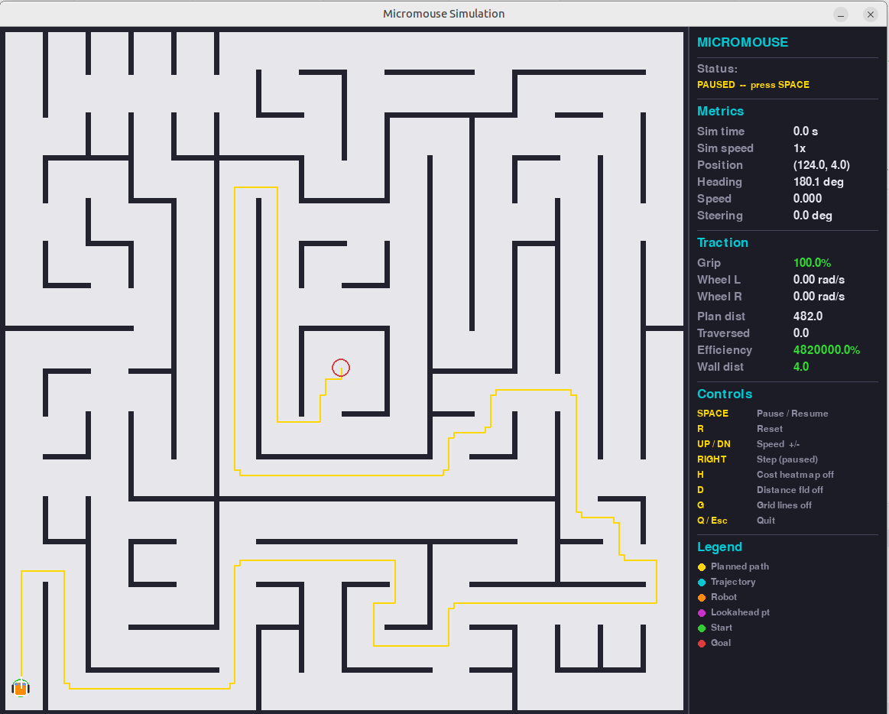
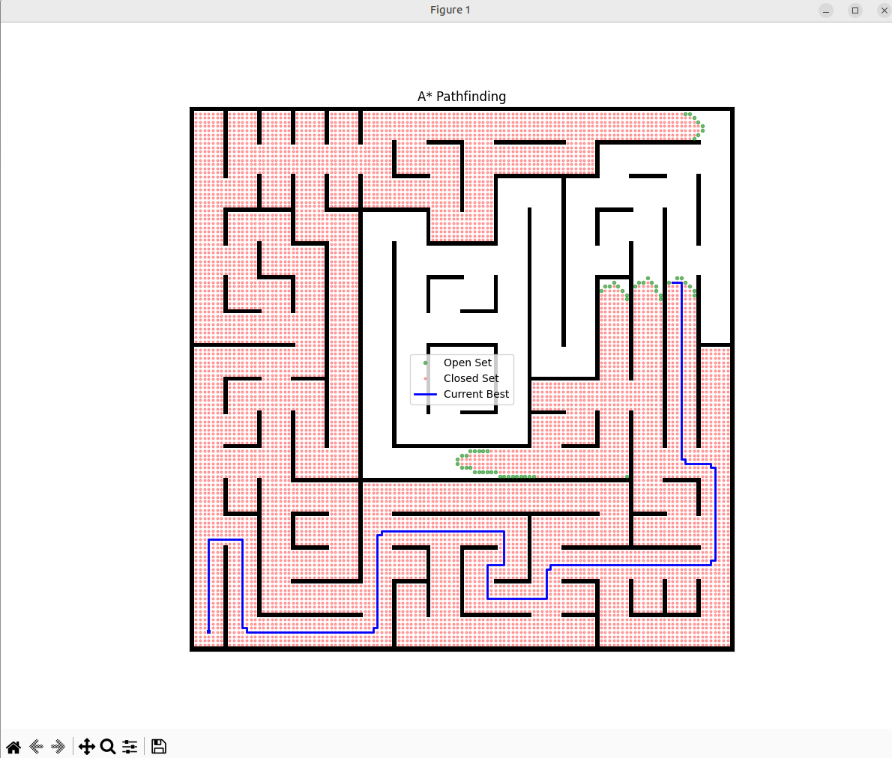

# Micromouse Simulation

 *Micromouse maze*

A Python simulation of a micromouse robot navigating through a maze using:
- **Multiple path planning algorithms**: A* (baseline), Theta* (any-angle), or RRT (sampling-based)
- **Advanced path tracking controllers**: Pure Pursuit and Stanley Controller
- **Path optimization**: Clothoid curve smoothing for minimum curvature
- **Collision detection** with wall avoidance

## Assignment Context

This is an educational project for **EE5109 - Advanced Robotics**. Students enhance the baseline micromouse simulation by:
1. **Implementing 2 of 3 path planning algorithms** (choose from: A* enhancements, Theta*, or RRT)
2. **Implementing Stanley Controller** for path tracking (comparing with baseline Pure Pursuit)
3. **Implementing clothoid-based path optimization** for smooth, minimum-curvature paths
4. **Analyzing and comparing** performance across different algorithms and configurations

### Implementation Guides

- **[Assignment Instructions](./assignment.md)** - Complete assignment requirements and rubric
- **[Theta* Integration](./theta_star_integration.md)** - Any-angle path planning (5-20% shorter paths)
- **[RRT Integration](./rrt_integration.md)** - Sampling-based path planning with 3 variants (basic, Sobol, smoothed)
- **[Stanley Controller](./stanley.md)** - Advanced path tracking with differential drive adaptation
- **[Clothoid Optimization](./clothoids.md)** - Euler spiral smoothing for optimal curvature
- **[Integration Guide](./INTEGRATION_GUIDE.md)** - Quick reference for connecting all components
- **[Algorithms Overview](./ALGORITHMS.md)** - Baseline A* and Pure Pursuit explanations

## Table of Contents
- [Features](#features)
- [Installation](#installation)
- [What's Provided vs What to Implement](#whats-provided-vs-what-to-implement)
- [How It Works](#how-it-works)
- [Configuration](#configuration)
- [Usage](#usage)
- [File Structure](#file-structure)
- [Testing Your Implementation](#testing-your-implementation)
- [Common Issues](#common-issues)
- [License](#license)

## Features

### Maze System
- **Flexible maze import**: CSV or TXT format (1=wall, 0=free, 2=start, 4=end)
- **Large maze library**: 100+ classic micromouse competition mazes included
- **Multiple goal handling**: Automatically selects centroid of goal region
- **Wall distance computation**: For safety-aware path planning



### Path Planning Algorithms
- **A* (Baseline - Provided)**: 
  - Grid-based optimal planning with configurable heuristics
  - Wall proximity cost for safer paths
  - Turn cost penalty for smoother paths
- **Theta* (Provided with adapter)**: 
  - Any-angle planning for 5-20% shorter paths
  - Line-of-sight path compression
  - Full integration with Map class
- **RRT (Sample code provided - 3 variants)**: 
  - Basic RRT with uniform random sampling
  - RRT with Sobol quasi-random sampling (faster convergence)
  - RRT with path smoothing post-processing
  - Integration guide provided, needs adapter like Theta*



### Path Tracking Controllers
- **Pure Pursuit (Baseline - Provided)**:
  - Geometric lookahead-based tracking
  - Adaptive speed control
  - Real-time visualization
- **Stanley Controller (To Implement)**:
  - Heading error + cross-track error correction
  - Velocity-adaptive gains
  - Differential drive conversion included

### Path Optimization
- **Clothoid Smoothing (To Implement)**:
  - Euler spiral curves for constant curvature rate
  - Kinematically optimal for differential drive
  - Safety verification with wall clearance
  - Velocity profile generation from curvature

### Visualization & Analysis
- **Real-time planning visualization**: See A* search progress or RRT tree growth
- **Path tracking visualization**: Robot position, heading, lookahead/nearest point
- **Comparative plots**: Side-by-side algorithm comparisons
- **Curvature profiles**: Analyze path smoothness before/after optimization
- **Performance metrics**: Path length, computation time, tracking error

### Configuration System
- **YAML-based**: Easy parameter tuning without code changes
- **Algorithm selection**: Switch planners and controllers via config
- **Debug modes**: Enable/disable visualization for each component
- **Physical units**: Optional metric speed conversion (m/s)

## Installation

1. **Clone the repository**:
   ```bash
   git clone <repository-url>
   cd micromouse-assignment
   ```

2. **Create virtual environment** (recommended):
   ```bash
   python -m venv venv
   source venv/bin/activate  # On Windows: venv\Scripts\activate
   ```

3. **Install dependencies**:
   ```bash
   pip install -r requirements.txt
   ```

4. **Verify installation**:
   ```bash
   python simulation.py
   ```
   You should see the baseline A* + Pure Pursuit simulation run.

## Dependencies

- **Python 3.7+** (tested on 3.10-3.12)
- **Core packages**:
  ```
  numpy          # Numerical operations
  matplotlib     # Visualization
  pyyaml         # Configuration files
  pygame         # Real-time simulation
  pyclothoids    # Clothoid curve generation (for path optimization)
  ```

All dependencies are listed in `requirements.txt`.

## What's Provided vs What to Implement

### Provided (Baseline)

| Component | File | Description |
|-----------|------|-------------|
| **A* Planner** | `pathPlanning.py` | Complete implementation with wall/turn costs |
| **Theta* Adapter** | `pathPlanning.py` + `theta_star.py` | Ready-to-use wrapper for Theta* algorithm |
| **RRT Samples** | `rrt.py`, `rrt_with_sobol_sampler.py`, `rrt_with_pathsmoothing.py` | 3 RRT variants as reference implementations |
| **Pure Pursuit** | `pathTracking.py` | Geometric path tracking controller |
| **Map System** | `micromouse.py` | Maze loading, state management, visualization |
| **Diff Drive Robot** | `diff_drive_robot.py` | Kinematic model and collision detection |
| **Simulation Loop** | `simulation.py` | Main execution framework |
| **100+ Mazes** | `mazefiles/` | Competition mazes for testing |

### To Implement (Assignment Requirements)

| Component | File | Implementation Guide | Points |
|-----------|------|---------------------|--------|
| **2 Path Planners** | `pathPlanning.py` | Choose 2: Theta*(provided)/RRT(samples)/Enhanced A* | 25 |
| **Stanley Controller** | `pathTracking.py` | See [stanley.md](./stanley.md) | 25 |
| **Clothoid Optimization** | `micromouse.py` | See [clothoids.md](./clothoids.md) | 25 |
| **Analysis Report** | PDF (5-10 pages) | Comparison and insights | 25 |

**Note**: Both Theta* and RRT have reference implementations provided. Theta* is fully integrated with an adapter, while RRT has 3 sample variants that you'll need to integrate (see [rrt_integration.md](./rrt_integration.md)). You can use either as one of your two planners.

## How It Works

### Complete Pipeline

```
┌─────────────────┐
│  1. Load Maze   │ ← config.yaml specifies maze file
│   (Map class)   │   Parses CSV/TXT, identifies start/goal
└────────┬────────┘
         │
         ▼
┌─────────────────┐
│ 2. Path Planning│ ← Choose algorithm: astar, theta_star, rrt
│  (AStar/Theta*) │   Produces waypoint list: [(x₀,y₀), (x₁,y₁), ...]
└────────┬────────┘
         │
         ▼
┌─────────────────┐
│ 3. Optimization │ ← Optional: clothoid smoothing
│ (optimize_path) │   Replaces sharp corners with Euler spirals
└────────┬────────┘
         │
         ▼
┌─────────────────┐
│ 4. Path Tracking│ ← Choose controller: pure_pursuit, stanley
│  (PurePursuit)  │   Computes control commands (v, ω)
└────────┬────────┘
         │
         ▼
┌─────────────────┐
│ 5. Robot Motion │ ← Differential drive kinematics
│ (DiffDriveRobot)│   Updates position, checks collisions
└────────┬────────┘
         │
         ▼
┌─────────────────┐
│  6. Results &   │ ← Performance metrics and visualization
│  Visualization  │   Path comparison, tracking error plots
└─────────────────┘
```

### Detailed Component Flow

#### 1️**Maze Loading** (`micromouse.py: Map class`)
- Reads maze from CSV/TXT specified in `config.yaml`
- Format: `1`=wall, `0`=free, `2`=start, `4`=goal (multiple goal cells → centroid)
- Creates 2D grid of `State` objects
- Computes wall distance map for safety-aware planning

#### 2️**Path Planning** (`pathPlanning.py`)
**A* (Baseline)**:
- Grid-based search with f = g + h heuristic
- Optional wall proximity cost (stay away from walls)
- Optional turn cost (prefer smoother paths)

**Theta* (Provided)**:
- Extends A* with line-of-sight path compression
- Produces 5-20% shorter paths with fewer waypoints
- Requires adapter to convert Map ↔ obstacle lists

**RRT (Sample implementations provided)**:
- 3 variants: basic, Sobol sampling, with path smoothing
- Randomly samples free space to build exploration tree
- Finds path by backtracking through tree
- Requires adapter similar to Theta* (see [rrt_integration.md](./rrt_integration.md))

#### 3️ **Path Optimization** (`micromouse.py: optimize_path`)
- **Input**: Waypoint list from planner
- **Process**: 
  1. Detect corners (heading changes > threshold)
  2. Fit clothoid curves to smooth corners
  3. Verify safety (maintain min clearance from walls)
  4. Resample at uniform intervals
- **Output**: Smoothed path with continuous curvature
- **Benefit**: Reduces peak curvature by 70-90%, enables higher speeds

#### 4️ **Path Tracking** (`pathTracking.py`)
**Pure Pursuit (Baseline)**:
- Finds lookahead point on path at fixed distance
- Computes steering angle toward lookahead point
- Simple but can cut corners or oscillate

**Stanley (To Implement)**:
- Combines heading error and cross-track error
- δ = ψ + arctan(k·e/(v+k_s))
- Velocity-adaptive: automatic gain adjustment with speed
- Converts steering angle → wheel velocities for diff drive

#### 5️ **Robot Motion** (`diff_drive_robot.py`)
- **Kinematic Model**: ẋ = v·cos(θ), ẏ = v·sin(θ), θ̇ = ω
- **Integration**: Updates position each timestep (dt)
- **Collision**: Ray-casting to detect wall intersections
- **Termination**: Reaches goal or hits wall

#### 6️ **Visualization & Metrics**
- Real-time: Shows robot navigating maze
- Final plot: Planned vs actual path comparison
- Metrics: Path length, time, collisions, tracking error

## Configuration

Edit `config.yaml` to control all aspects of simulation:

### Key Configuration Sections

```yaml
# ============================================
# ALGORITHM SELECTION
# ============================================
path_planner: "theta_star"      # Options: astar, theta_star, rrt
tracking_controller: "pure_pursuit"  # Options: pure_pursuit, stanley

# ============================================
# MAZE CONFIGURATION
# ============================================
maze_file: "mazefiles/classic/alljapan-045-2024-exp-fin.txt"

physical_dimensions:
  maze_width_meters: 2.88     # Standard AAMC: 16×16 cells × 0.18m
  use_metric_speeds: true     # Convert speeds to m/s

# ============================================
# A* PARAMETERS
# ============================================
astar:
  debug: false                # Enable search visualization
  heuristic_weight: 1.0       # h(n) multiplier (1.0 = admissible)
  turn_cost_enabled: true     # Penalize direction changes
  turn_cost_weight: 2.0       # Higher = smoother paths

wall_cost:                    # Stay away from walls
  enabled: true
  weight: 4.0
  decay: "exponential"
  threshold: 5.0

# ============================================
# THETA* PARAMETERS
# ============================================
theta_star:
  resolution: 1.0             # Grid cell size
  robot_radius: 0.3           # Collision buffer
  debug: true

# ============================================
# RRT PARAMETERS (when implemented)
# ============================================
rrt:
  max_iter: 1000
  step_size: 0.5
  goal_bias: 0.1              # Probability of sampling goal

# ============================================
# PATH OPTIMIZATION
# ============================================
path_optimization:
  enabled: true
  method: "clothoid"          # or "circular_arc", "bezier"
  min_wall_clearance: 0.3
  turn_threshold: 15          # degrees

# ============================================
# PURE PURSUIT CONTROLLER
# ============================================
pure_pursuit:
  lookahead_distance: 3.0     # Grid units ahead
  max_speed: 0.5              # m/s or grid units/s
  min_speed: 0.2
  debug: true                 # Show tracking visualization

# ============================================
# STANLEY CONTROLLER (when implemented)
# ============================================
stanley:
  k: 1.0                      # Cross-track error gain
  k_soft: 1.0                 # Low-speed softening
  max_steer: 1.047            # Max steering angle (radians)
  wheel_base: 0.08            # Distance between wheels (m)
  max_speed: 0.5
  debug: true

# ============================================
# SIMULATION
# ============================================
simulation:
  window_size: 900
  fps: 60

visualization:
  figure_size: [12, 12]
  cmap_colors: ['white', 'black', 'green', 'red', 'blue']
```


### Quick Config Changes

**Test different planners**:
```yaml
path_planner: "astar"       # Fast, grid-aligned
path_planner: "theta_star"  # Shorter paths, any-angle
path_planner: "rrt"         # Sampling-based
```

**Test different controllers**:
```yaml
tracking_controller: "pure_pursuit"  # Simple, lookahead-based
tracking_controller: "stanley"       # Advanced, error-based
```

**Enable/disable debug visualization**:
```yaml
astar:
  debug: true          # See A* search progress
pure_pursuit:
  debug: true          # See lookahead point and trajectory
```

**Try different mazes**:
```yaml
maze_file: "mazefiles/classic/AAMC16Maze.txt"           # Simple
maze_file: "mazefiles/classic/alljapan-045-2024-exp-fin.txt"  # Complex
maze_file: "mazefiles/halfsize/2012.txt"                # Half-size
```

## Usage

### Basic Simulation (Interactive)

```bash
# Run with default configuration
python simulation.py

# Run with specific config file
python simulation.py my_config.yaml
```

**Controls** (during interactive simulation):
- `SPACE` - Pause/Resume
- `R` - Full reset (rebuild maze, re-plan)
- `UP/DOWN` - Increase/Decrease speed
- `H` - Toggle wall-cost heatmap
- `G` - Toggle grid lines
- `Q/ESC` - Quit

### Benchmark Mode (Fast Testing)

For rapid parameter tuning without visualization:

```bash
# Run headless benchmark (much faster!)
python simulation.py --benchmark

# With custom config
python simulation.py --benchmark my_config.yaml
```

**Benchmark mode features:**
- Use this for rapid prototyping and parameter tuning
- Runs at maximum speed (no frame rate limiting)
- Prints competition metrics to console
- No pygame window (headless)

**Example output:**
```
============================================================
COMPETITION RESULTS
============================================================
  Completion Time:    12.345 seconds - COMPETITION SCORE
  Path Length:        89.234 units (reference)
  Planned Distance:   87.123 units
  Path Efficiency:    97.6%
  Collisions:         0
  Status:             QUALIFIED
============================================================

============================================================
```

### Test Different Configurations

```bash
# 1. Edit config.yaml to select algorithms
path_planner: "theta_star"
tracking_controller: "pure_pursuit"

# 2. Run benchmark for quick test
python simulation.py --benchmark

# 3. If satisfied, run interactive mode to visualize
python simulation.py
```

### Convert Maze Formats

```bash
# Convert TXT to CSV format
python micromouse.py convert input.txt output.csv
```

### Run With Specific Maze

Edit `config.yaml`:
```yaml
maze_file: "mazefiles/classic/alljapan-028-2007-exp-fin.txt"
```

Or many mazes are provided:
- `mazefiles/classic/` - Full-size competition mazes
- `mazefiles/halfsize/` - Half-size competition mazes  
- `mazefiles/training/` - Training mazes


## Testing Your Implementation

### 1. Test Path Planners

```python
# Compare A* vs Theta*
def compare_planners(maze_map, config):
    results = {}
    
    # Test A*
    astar = AStar(maze_map, config)
    path_astar = astar.a_star()
    results['A*'] = {
        'waypoints': len(path_astar),
        'length': calculate_path_length(path_astar)
    }
    
    # Test Theta*
    theta = ThetaStar(maze_map, config)
    path_theta = theta.plan()
    results['Theta*'] = {
        'waypoints': len(path_theta),
        'length': calculate_path_length(path_theta)
    }
    
    return results
```

### 2. Test Controllers

```yaml
# Test Pure Pursuit
tracking_controller: "pure_pursuit"
pure_pursuit:
  debug: true          # Enable visualization
  lookahead_distance: 3.0

# Then test Stanley
tracking_controller: "stanley"
stanley:
  debug: true
  k: 1.0
```

### 3. Test Path Optimization

```python
# Compare before/after optimization
raw_path = planner.plan()
optimized_path = optimize_path(raw_path, maze_map)

print(f"Raw waypoints: {len(raw_path)}")
print(f"Optimized waypoints: {len(optimized_path)}")
print(f"Curvature reduction: {calculate_curvature_improvement()}")
```

### 4. Test on Multiple Mazes

```bash
# Create a test script
for maze in mazefiles/classic/*.txt; do
    echo "Testing $maze"
    # Update config.yaml with maze file
    python simulation.py
done
```

### Success Criteria

**Path Planning**:
- Finds valid path from start to goal
- No paths through walls
- Theta* produces shorter paths than A* (5-20%)
- RRT finds paths within max_iter iterations


##  Report Guidelines

### Suggested Analysis Structure

1. **Introduction**: Briefly describe micromouse problem and your approach

2. **Methodology**: 
   - Which 2 planners you chose and why
   - Stanley controller implementation details
   - Clothoid optimization approach

3. **Results**:
   - **Planner comparison table**: waypoints, length, time, success rate
   - **Controller comparison table**: tracking error, speed, completion time
   - **Optimization impact**: curvature reduction, path quality metrics

4. **Visualizations**:
   - Side-by-side path comparisons
   - Curvature profiles (before/after optimization)
   - Tracking error plots
   - Algorithm-specific (RRT tree, Theta* shortcuts)

5. **Discussion**:
   - Trade-offs observed
   - Parameter sensitivity
   - Failure cases and solutions
   - Computational performance

6. **Conclusion**: Best configurations for different scenarios

### Metrics to Report

- Path length (units and meters)
- Number of waypoints
- Planning time (milliseconds)
- Number of turns / total curvature
- Average tracking error (cross-track distance)
- Maximum tracking error
- Total navigation time
- Success rate across mazes

## Additional Resources

- **PythonRobotics**: https://github.com/AtsushiSakai/PythonRobotics
- **Theta* Paper**: Nash et al., "Theta*: Any-Angle Path Planning on Grids", AAAI 2007
- **Stanley Paper**: Thrun et al., "Stanley: The Robot that Won the DARPA Grand Challenge", 2006
- **RRT Paper**: LaValle, "Rapidly-Exploring Random Trees", 1998
- **Clothoids**: Bertolazzi & Frego, "G¹ fitting with clothoids", 2015


## License

MIT License - Free for academic and personal use.

See [LICENSE](LICENSE) for details.