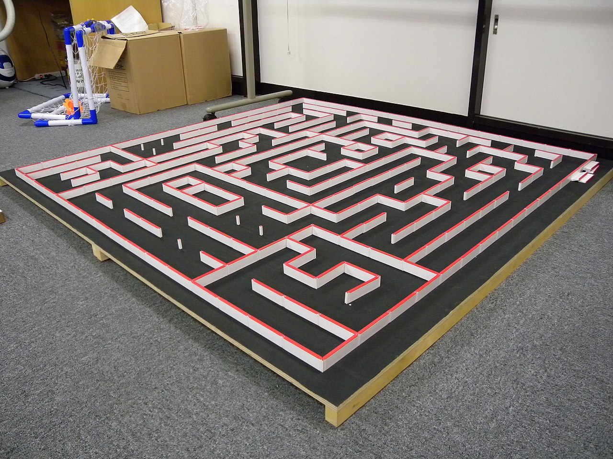
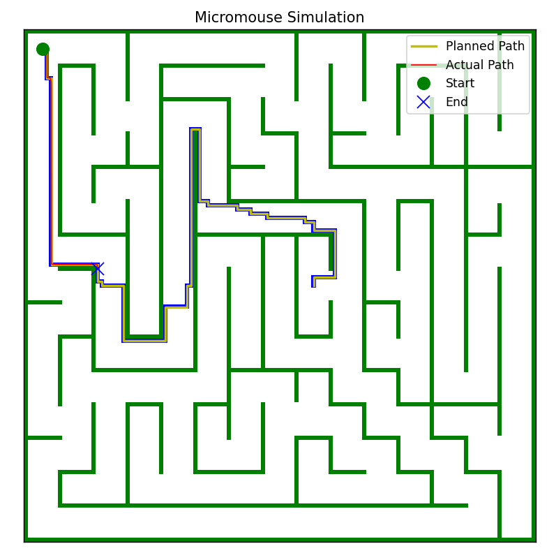

# Micromouse Simulation

 *Micromouse maze*

A Python simulation of a micromouse robot navigating through a maze using:
- **A* algorithm** for optimal path planning
- **Pure Pursuit controller** for smooth path following
- **Collision detection** with wall avoidance

## Assignment details:
A full description of the assignment is provided here: [assignment instructions](./assignment.md). Follow the instructions to add additional path planning and path tracking methods, and path optimization.

## Table of Contents
- [Features](#features)
- [Installation](#installation)
- [Dependencies](#dependencies)
- [How It Works](#how-it-works)
- [Configuration](#configuration)
- [Usage](#usage)
- [File Structure](#file-structure)
- [Example Output](#example-output)
- [License](#license)

## Features

- **Maze Import**: Reads maze configurations from CSV or TXT files (1=wall, 0=free, 2=start, 4=end)
- **Path Planning**: Uses A* algorithm to find optimal paths
- **Path Following**: Pure Pursuit controller for smooth navigation
- **Collision Detection**: Stops simulation if walls are hit
- **Visualization**: Real-time and final path visualizations
- **Configuration**: YAML-based parameter tuning

## Installation

1. Clone the repository:
   ```bash
   git clone https://github.com/yourusername/micromouse-simulation.git
   cd micromouse-simulation
   ```

2. Install dependencies:
   ```bash
   pip install -r requirements.txt
   ```

3. Prepare your maze file:
   - Create a `maze.csv` or `maze.txt` file in the root directory
   - Format: `1` for walls, `0` for free space, `2` for start, `4` for goal
   - To convert TXT to CSV: `python micromouse.py convert input.txt output.csv`

## Dependencies

- Python 3.7+
- Required packages:
  ```
  numpy
  matplotlib
  pyyaml
  ```

## How It Works

### Program Flow
1. **Maze Loading**:
   - Reads maze from `maze.csv` or `maze.txt` (configurable in config.yaml)
   - TXT format: space or comma separated (1=wall, 0=free, 2=start, 4=end)
   - Identifies start and goal positions

2. **Path Planning**:
   - Uses A* algorithm to find optimal path
   - Calculates and displays planned path distance

3. **Path Following**:
   - Pure Pursuit controller follows the planned path
   - Dynamically adjusts speed and steering
   - Checks for collisions with walls

4. **Results**:
   - Displays actual traversed distance
   - Shows visualization comparing planned vs actual path

### Key Algorithms
- **A* Path Planning**:
  - Optimal pathfinding using heuristic search
  - Configurable heuristic weight

- **Pure Pursuit**:
  - Lookahead-based path following
  - Adaptive speed control based on curvature

## Configuration

Edit `config.yaml` to tune parameters:

```yaml
# Maze file: .csv or .txt
maze_file: maze.csv

visualization:
  figure_size: [12, 12]
  cmap_colors: ['white', 'black', 'green', 'red', 'blue']
  
astar:
  debug: False
  visualize_every: 50
  heuristic_weight: 1.0

pure_pursuit:
  lookahead_distance: 1.5
  max_speed: 0.5
  min_speed: 0.2
  steering_gain: 1.0

micromouse:
  dt: 0.1
  goal_threshold: 0.5
  min_speed_threshold: 0.01
```

## Usage

Run the simulation:
```bash
python micromouse.py
```

Convert TXT maze to CSV:
```bash
python micromouse.py convert my_maze.txt my_maze.csv
```

## File Structure

```
micromouse-simulation/
├── main.py                # Main simulation program
├── astar.py               # A* path planning implementation
├── pursuit.py             # Pure Pursuit controller
├── maze.csv               # Maze definition file
├── config.yaml            # Simulation parameters
├── requirements.txt       # Python dependencies
└── README.md              # This documentation
```

## Example Output
The program will display a visualization showing:
- Maze walls (black)
- Start position (green)
- Goal position (red)
- Planned path (yellow)
- Actual trajectory (red line)

 *Sample output*

```
Planned path distance: 15.67 units
Actual traversed distance: 16.23 units
COLLISION DETECTED! Distance traveled: 8.45 units
```


## License

MIT License - Free for academic and personal use

