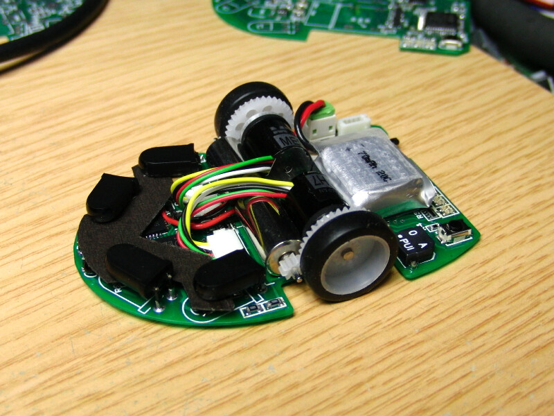

# Micromouse Simulation Assignment: Path Planning and Tracking Enhancements

## Objective
Enhance the existing **micromouse simulation** by implementing advanced path planning and tracking algorithms while optimizing the path for smooth, safe navigation.

## Baseline Code
You will start with the provided codebase that includes:
- A* path planning (`pathPlanning.py`)
- Pure Pursuit path tracking (`pathTracking.py`)
- Main simulation framework (`main.py`)

## Assignment Requirements

### 1. Implement RRT Path Planning (25 points)
- **Add RRT implementation** in a new `rrt.py` file
- **Modify main.py** to support both A* and RRT planning
- **Compare results** between A* and RRT in your report
- **Visualization** must show both planning methods

### 2. Implement LQR Path Tracking (25 points)
- **Add LQR controller** in a new `lqr.py` file
- **Modify pursuit.py** to support both Pure Pursuit and LQR
- **Compare performance** between tracking methods
- **Demonstrate stability** with different speed profiles

### 3. Path Optimization (25 points)
- **Safety margins**: Ensure path stays at least 0.3 units from walls
- **Smooth turns**: Implement path smoothing to minimize sharp turns
- **Speed optimization**: Adjust speed based on turn radius
- **Visual indicators**: Show safety margins in visualization

### 4. Analysis and Report (25 points)
- **Performance metrics**: Compare computation time and path length
- **Failure analysis**: Document any collision cases
- **Optimization results**: Show before/after path comparisons
- **Conclusion**: Recommend best planning/tracking combinations

## Implementation Guide

### RRT Implementation Tips
1. Use the existing `Map` class for collision checking
2. Parameters to include:
   ```python
   class RRT:
       def __init__(self, map, max_iter=1000, step_size=0.5, goal_bias=0.1):
           # Your implementation
   ```
3. Visualize the tree growth during planning (optional bonus)

### LQR Implementation Tips
Assume the micromouse is a 2-wheeled differential drive mouse robot, as per example shown below:
 *2-wheeled mouse*

Base your linearized model on this design

1. Design for these parameters:
   ```python
   class LQR:
       def __init__(self, Q=np.eye(4), R=np.eye(2)):
           # Q: State cost matrix
           # R: Control cost matrix
   ```
2. Implement both lateral and longitudinal control
3. Consider adding feedforward terms for better tracking

### Path Optimization Tips
1. Add post-processing to the planned path:
   ```python
   def optimize_path(path, map, min_distance=0.3):
       # Your safety and smoothing implementation
   ```
2. An implementation of Bezier curves has been outlined in the `bezier.md` file in this project. Integrate this implementation and explore the parameters to optimize the path.

## Deliverables
1. **Code Submission**:
   - All Python files with your implementations
   - Updated requirements.txt if new dependencies are added
   - Example maze files demonstrating different scenarios

2. **Report PDF** (5-10 pages):
   - Methodology section explaining your implementations
   - Results with comparative analysis
   - Visualization of key findings
   - Challenges faced and solutions

## Grading Rubric

| Criteria                | Points |
|-------------------------|--------|
| RRT Implementation      | 25     |
| LQR Implementation      | 25     |
| Path Optimization       | 25     |
| Analysis and Report     | 25     |
| **Total**               | **100**|

**Percentage of module grade: 20%**

## Deadline
Submit your work by **Midnight, 6th April, 2025** via Canvas. 


